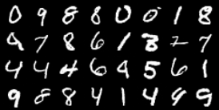
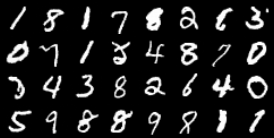
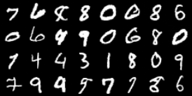

# ⚡ DiffLightning

**DiffLightning** is a clean, modular, and efficient **PyTorch Lightning** implementation of Denoising Diffusion Probabilistic Models (DDPM), based on the 2020 paper by Ho et al.

This project aims to provide a robust codebase for training and sampling from diffusion models, abstracting away the training loop boilerplate thanks to Lightning, while keeping the U-Net architecture and the diffusion process mathematically faithful to the original implementation.


[](https://lightning.ai/)
[](https://www.python.org/)

## ✨ Features

- **⚡ PyTorch Lightning Power**: Zero boilerplate training loops, automatic device handling, mixed-precision support, and easy checkpointing.
- **📊 Logging**: Integrated **WandB** logging for tracking training loss, validating generated samples, and monitoring **FID score** in real-time.
- **🧩 Modular Architecture**: Highly customizable U-Net backbone. Via config, you can easily tweak:
  - Channel multipliers and base width.
  - Attention resolutions (e.g., `16x16`, `4x8`).
  - Timesteps ($T$) and data augmentation.
- **🖼️ Multi-Dataset Support**: Native support for **MNIST** and **CIFAR-10** (with automatic download and normalization).
- **🛠️ Config-Driven**: All hyperparameters (training, model, data) are managed via a simple YAML configuration file.

## 📂 Project Structure

```text
DiffLightning/
├── config/
│   └── training_config.yaml  # Main configuration file
|-- docs/
    └── samples/
├── src/
│   ├── backbone.py           # U-Net implementation (ResBlocks, Attention)
│   ├── dataset.py            # LightningDataModules for MNIST/CIFAR
│   ├── model.py              # The Diffusion Model
│   ├── noise_scheduler.py    # Forward process implementation
│   ├── sampling.py           # Inference logic wrapper
│   └── training.py           # Training wrapper
├── notebooks/
│   └── main.ipynb            # Jupyter Notebook for interactive experiments
├── checkpoints/              # Directory for saved models
├── main.py                   # CLI Entry point
└── requirements.txt
```
## 🚀 Quick Start
**Installation**
```bash
git clone [https://github.com/your-username/DiffLightning.git](https://github.com/your-username/DiffLightning.git)
cd DiffLightning
pip install -r requirements.txt
```
## 🖥️ Usage
You can interact with the project either via the command line (main.py) or using the interactive notebook.
### 1. Training
To train a diffusion model from scratch:

```bash
python main.py --train --config ./config/training_config.yaml
```
**Resuming training**: if you want to resume training from a specific checkpoint (e.g., interrupted run):
```bash
python main.py --train --config ./config/training_config.yaml --ckpt ./checkpoints/last.ckpt
```
### 2. Sampling (Inference)

**To generate images** using a trained model checkpoint:
```bash
python main.py --sample --ckpt ./checkpoints/ddpm_mnist_v1.ckpt --n_samples 16 --save_path ./results/sample.jpg
```
### 3. CLI Arguments Reference
|Argument|	Description	| Default|
|:---|:---:|:---:|
|-t, --train|	Flag to start training mode|False |
|-s, --sample|	Flag to start sampling mode|False|
|--config	|Path to the YAML configuration file|	./config/training_config.yaml
|--ckpt	|Path to .ckpt file (Required for sampling, optional for resuming train)|	None
|-n, --n_samples|	Number of images to generate|	16
|-p, --save_path|	Path for saving the sample |None |

### 4. Jupyter Notebook
You can also use use the provided Jupyter notebook ```notebooks/main.ipynb```
## ⚙️ Configuration
Training, datasets, backbone and logging settings are specified using a simple yaml configuration file: ```config/training_config.yaml```
## 🖼️ Gallery
### MNIST Samples
The following samples were generated with a Diffusion Model trained on MNIST using Lightning AI Studio on a single NVIDIA T4 GPU, using settings ```config/training_config.yaml```. Checkpoint available as part of the current release.
|  |  |
|---------------------------------------------------|---------------------------------------------------|
|  |  |


## 📄 References

This implementation is based on the 2020 paper [Denoising Diffusion Probabilistic Model](https://arxiv.org/abs/2006.11239) by Hol et al.

